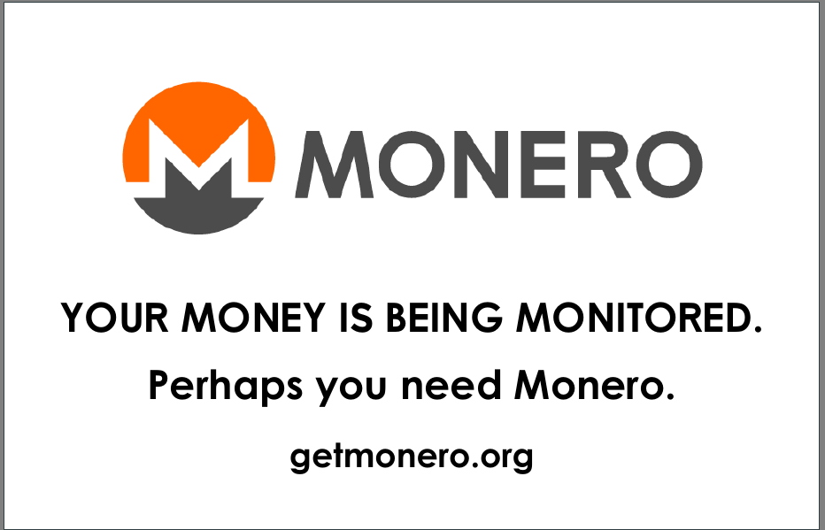

# Monero Propaganda Card

Some discreet Monero propaganda.



## Instructions

This is a standard UK-sized business card, although you can change the size in the `front.tex` file. If you're happy with it as-is, just send the completed pdf to the printer of your choice.

## Typesetting

### Font

You will need the [MoneroGothic typeface](https://www.monerooutreach.org/monero-typography.html) installed.

### Compiling

You will need a [LaTeX](https://www.latex-project.org/) distribution (I use [TexLive](https://www.tug.org/texlive/)) that's capable of using `lualatex`. You will also need `make` installed if you wish to use the supplied `Makefile` to build your document.

You will also need to install the *MoneroGothic* font.

To build your document, in the root of this directory, run make:

```
$ make
```

### Adjusting Size

In `front.tex`, you can change the size by adjusting the values in the size snippet:

```
\usepackage[
  paperwidth = 85mm,
  paperheight = 55mm,
  margin = 0.2in,
  noheadfoot
]{geometry}
```

### Modifying Text

Inside the `document` section, you'll find the text content. This is what you'll want to modify.

```
\begin{document}
		\thispagestyle{empty}

		% Monero logo
		\begin{center}
			\includegraphics[width = 0.9\textwidth]{monero-logo-800.png}
		\end{center}

		% Text
		\centerline{\large\textsf{\textbf{YOUR MONEY IS BEING MONITORED.}}}
		\centerline{\large\textsf{\textbf{Perhaps you need Monero.}}}

		% Link to getmonero.org
		\centerline{\textsf{\textbf{getmonero.org}}}
\end{document}
```
